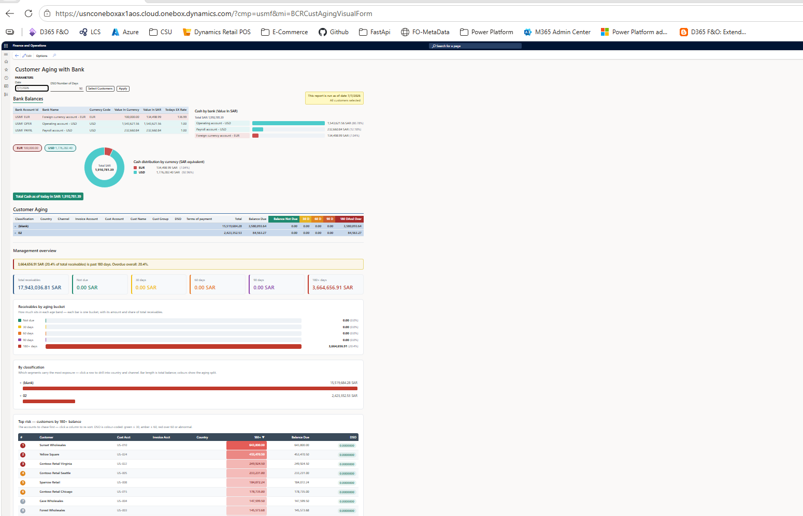

# 🏦 Customer Aging with Bank

> A custom **Microsoft Dynamics 365 Finance & Operations (D365 F&O)** Accounts Receivable solution that combines **customer aging analysis**, **credit exposure**, and **live bank balances** into a single interactive experience — delivered both as an **ECharts-powered visual form** and a classic **SSRS report**.


---

## 📑 Table of Contents

- [✨ Overview](#-overview)
- [🖼️ Form Output](#️-form-output)
- [🧩 Solution Architecture](#-solution-architecture)
- [📦 Package Contents](#-package-contents)
- [🎛️ Parameters](#️-parameters)
- [📊 What the Visual Shows](#-what-the-visual-shows)
- [🗄️ Data Model](#️-data-model)
- [🧮 Key Calculations](#-key-calculations)
- [🔐 Security](#-security)
- [🧭 Navigation](#-navigation)
- [🚀 Deployment](#-deployment)
- [⚠️ Known Caveats & Design Notes](#️-known-caveats--design-notes)
- [👤 Author](#-author)

---

## ✨ Overview

**Customer Aging with Bank** is a self‑contained reporting feature for the **Accounts Receivable** module. It answers three questions on one screen:

- 💳 **How much do customers owe, and how old is it?** — a collapsible aging tree bucketed into *Not Due / 30 / 60 / 90 / 180+ days*.
- 🛡️ **How exposed are we?** — credit limits, credit utilisation, open sales orders, credit‑insurance and promissory‑note cover, plus a **DSO** (Days Sales Outstanding) indicator.
- 🏦 **How much cash do we actually hold?** — live **bank balances** by account, converted to a reporting currency (**SAR**) using the exchange rate as of the report date.

The same underlying dataset is surfaced two ways:

| Delivery | Object | Best for |
|----------|--------|----------|
| 🖥️ **Interactive visual form** | `BCRCustAgingVisualForm` | Day‑to‑day analysis, drill‑down, charts |
| 📄 **SSRS precision report** | `BCRCustomerAgingwithBankReport` | Printing, exporting, scheduled distribution |

---

## 🖼️ Form Output

The interactive form rendered in D365 F&O (`Accounts receivable → Inquiries and reports → Customer Aging with Bank`):



> 📥 **Download the screenshot:** [`CustAgingWithBank-form-output.png`](./CustAgingWithBank-form-output.png)

---

## 🧩 Solution Architecture

```
┌──────────────────────────────────────────────────────────────────────────┐
│                         BCRCustAgingVisualForm                             │
│  Parameters: Date · DSO Number of Days · Select Customers · Apply          │
└───────────────┬───────────────────────────────────────────┬──────────────┘
                │ init() / applyAndLoad()                    │ Select Customers
                ▼                                            ▼
     BCRCustAgingVisualEngine  ────────────────►  BCRCustomerAgingwithBankQuery
     (populate + getDataJson)   raw SQL + selects   (CustTable · AccountNum range)
                │
                │ fills
                ▼
     BCRCustomerAgingwithBankTmp  (TempDB temp table, 32 fields)
                │
                │ serialised to JSON
                ▼
     BCRCustAgingVisualControl (FormTemplateControl)
                │  hosts /resources/html/BCRCustAgingVisual
                ▼
     BCRCustAgingVisual.htm ──► BCRCustAgingVisualJS.js ──► BCRCustAgingEcharts.js
        (layout)                  (render tree/bank/KPIs)      (donut & bar charts)

  ── Parallel print path ──
     BCRCustomerAgingwithBankDP (SSRS RDP) ──► BCRCustomerAgingwithBankReport (SSRS)
```

**Two data paths, one shared shape:**

- The **visual form** uses `BCRCustAgingVisualEngine` to fill the temp table and emit JSON to the browser control.
- The **SSRS report** uses `BCRCustomerAgingwithBankDP` (a pre‑processed temp‑DB Report Data Provider) to fill the *same* temp‑table structure for the precision design.

---

## 📦 Package Contents

The `.axpp` deployable package ships in model **`OHMS`** and contains **29 files** across the following object types:

### 🧠 Classes (X++)

| Class | Role |
|-------|------|
| `BCRCustomerAgingwithBankContract` | 📝 Data contract — carries the *as‑of* `FromDate` for the report |
| `BCRCustomerAgingwithBankDP` | 🗃️ SSRS Report Data Provider (`SRSReportDataProviderPreProcessTempDB`) — builds aging buckets, credit figures & bank balances |
| `BCRCustAgingVisualEngine` | ⚙️ Visual engine — `populate()` fills the temp table, `getDataJson()` serialises it for the browser |
| `BCRCustAgingVisualControl` | 🔌 `FormTemplateControl` hosting the HTML visual and exposing the dataset as a JSON property |
| `BCRCustAgingVisualControlBuild` | 🏗️ Build/design‑time companion class for the control |

### 🖼️ UI

| Object | Type | Purpose |
|--------|------|---------|
| `BCRCustAgingVisualForm` | Form | Interactive visual form (Custom pattern) |
| `BCRCustAgingVisualForm` | Menu Item (Display) | Opens the visual form |
| `BCRCustomerAgingwithBank` | Menu Item (Output) | Runs the SSRS report (`PrecisionDesign1`) |
| `AccountsReceivable.Report_Finance` | Menu Extension | Adds the form under *Inquiries and reports* |

### 🗃️ Data

| Object | Type | Purpose |
|--------|------|---------|
| `BCRCustomerAgingwithBankTmp` | Table (TempDB) | Pre‑processed dataset — **32 fields** |
| `BCRCustomerAgingwithBankQuery` | Query | `CustTable` with an `AccountNum` range (customer selection) |
| `CustTable.Report_Finance` | Table Extension | Adds 3 real fields: `BCRCreditInsuranceValue`, `BCRPromissoryNoteValue`, `BCRPromissoryNoteType_Custom` |
| `BCRCustomerAgingwithBankReport` | SSRS Report | Precision design (`DataSet1`) |

### 🎨 Resources

| Resource | Type | Notes |
|----------|------|-------|
| `BCRCustAgingVisual.htm` | HTML | Host layout — bank section, aging tree, empty‑state |
| `BCRCustAgingVisualJS.js` | JavaScript | Client control — renders run‑info, bank, aging tree & management overview |
| `BCRCustAgingEcharts.js` | JavaScript | Apache **ECharts** library (donut + bar charts) |
| `BCRCustAgingVisualCSS.css` | CSS | Stylesheet (most styling is inline — see caveats) |

### 🔤 Labels & 🔐 Security

| Object | Type |
|--------|------|
| `OHMSAging` (en‑US) | Label file |
| `OHMSCustAgingVisualView` | Security **Privilege** |
| `OHMSCustAgingVisualMaintain` | Security **Duty** |
| `OHMSCustAgingVisualInquirer` | Security **Role** |

---

## 🎛️ Parameters

The form exposes **three inputs**, arranged horizontally in the *Parameters* group:

| # | Parameter | Control | Default | Description |
|---|-----------|---------|---------|-------------|
| 1️⃣ | **Date** | Date picker | Today (user time zone) | The *as‑of* date driving aging buckets **and** bank exchange rates |
| 2️⃣ | **DSO Number of Days** | Int64 | `90` | Look‑back window used in the DSO calculation |
| 3️⃣ | **Select Customers** | Command button | *All customers* | Opens the standard query dialog to filter `CustTable.AccountNum` |

▶️ Click **Apply** to reload the visual (`applyAndLoad()` → `Engine.loadData()`).

---

## 📊 What the Visual Shows

Reading the [form output](#️-form-output) top to bottom:

### 🏦 1. Bank Balances
- A **table** of every active bank account: *Bank Account Id, Bank Name, Currency Code, Value in Currency, Value in SAR, Today's Exchange Rate*.
- A **“Cash by bank” bar chart** (value in SAR, with each account's share).
- **Currency pills** (e.g. `EUR`, `USD`) and a **donut chart** showing *cash distribution by currency* in SAR equivalent.
- A **“Total Cash as of today”** banner summarising all holdings in SAR.

### 🌳 2. Customer Aging (collapsible tree)
A four‑level expandable hierarchy, then customer leaf rows:

```
Classification ─► Country ─► Channel ─► Invoice Account ─► Customer rows
```

Each row shows **Total**, **Balance Due**, and the aging buckets:
**Balance Not Due · 30 · 60 · 90 · 180+ Days and Over**.

### 📈 3. Management Overview
- **KPI tiles**: total receivables and per‑bucket totals.
- **Receivables by aging bucket** — one bar per band with amount and % of total.
- **By classification** — bar length = total balance; colours show the aging split (click to drill into country/channel).
- **Top risk watchlist** — customers ranked by **180+ balance**, with a colour‑coded **DSO** column (green/amber/red).

---

## 🗄️ Data Model

`BCRCustomerAgingwithBankTmp` (**TempDB**) is the single dataset behind both the form and the SSRS report. Its 32 fields group into five themes:

| Group | Fields |
|-------|--------|
| 👤 **Customer** | `CustAccount`, `CustName`, `CustGroup`, `SalesDistrictId`, `PaymTermId`, `Country`, `Channel`, `CustClassificationId`, `InvoiceAccount` |
| ⏳ **Aging buckets** | `BalanceNotDue`, `BCR30_D`, `BCR60_D`, `BCR90_D`, `BCR180_DAndOver`, `BalanceDue`, `Total` |
| 🛡️ **Credit exposure** | `Creditlimit`, `CreditlimitUtilized`, `CreditlimitAvailable`, `OpenSalesOrder`, `BCRCreditInsuranceValue`, `BCRPromissoryNoteValue`, `BCRPromissoryNoteType_Custom`, `BCRDSO` |
| 🏦 **Bank** | `BankAccountId`, `BankName`, `Balance`, `CurrencyCode`, `ValueInSAR`, `TodaysEXTRate`, `TotalCurrencyValue`, `TotalSarValue` |

> The three custom credit‑cover fields (`BCRCreditInsuranceValue`, `BCRPromissoryNoteValue`, `BCRPromissoryNoteType_Custom`) are added to the standard **`CustTable`** via the `CustTable.Report_Finance` extension.

---

## 🧮 Key Calculations

### 💰 Aging buckets
Open transactions (`CustTransOpen` joined to `CustTrans`) are bucketed against the **as‑of Date** into *Not Due / 30 / 60 / 90 / 180+*. `Balance Due` is the sum of open amounts; `Total` = `Balance Due` + `Open Sales Orders`.

### 🛡️ Credit utilisation
```
Credit Limit Available = CreditMax − Balance Due
Credit Limit Utilized  = CreditMax − Credit Limit Available
```

### 📉 DSO (Days Sales Outstanding)
```
DSO = Total ÷ (InvSum × dsoNumber)
```
where **`InvSum`** is the sum of `CustInvoiceJour.INVOICEAMOUNT` for invoices dated within the last *`dsoNumber`* days (relative to the as‑of date), grouped by order account. Division by zero is guarded (returns `0`).

> ℹ️ Under this formula DSO is a small fraction for most customers, so it is displayed to **7 decimals** (helper `r2s7`) to stay visible instead of rounding to `0`. All money values use **2 decimals** (`r2s` / `fmt2`).

### 💱 Bank conversion
Each bank balance is converted to **SAR** using `ExchangeRateHelper::newExchangeDate(...)` at the **as‑of Date**, so historical dates use period‑correct rates.

---

## 🔐 Security

A complete role → duty → privilege chain ships with the package:

```
👥 Role      OHMSCustAgingVisualInquirer
   └── 🧰 Duty      OHMSCustAgingVisualMaintain
        └── 🔑 Privilege  OHMSCustAgingVisualView
             ├── ▶ BCRCustAgingVisualForm      (Display menu item)
             └── ▶ BCRCustomerAgingwithBank    (Output / SSRS menu item)
```

Assign the **`OHMSCustAgingVisualInquirer`** role to grant users access to both the visual form and the SSRS report.

---

## 🧭 Navigation

**Accounts receivable ▸ Inquiries and reports ▸ Customer Aging with Bank**

The `AccountsReceivable.Report_Finance` menu extension inserts the display menu item under the standard *Inquiries and reports* (`InquiriesAndReports`) submenu.

---

## 🚀 Deployment

1. 📥 **Import** the deployable package (`.axpp`) into Visual Studio via
   `Dynamics 365 ▸ Import Project`, or apply it as part of a model deployment.
2. 🔨 **Build** the `OHMS` model (this compiles the X++ classes and the SSRS report).
3. 🗄️ **Synchronize** the database (the `BCRCustomerAgingwithBankTmp` TempDB table and the `CustTable` extension fields).
4. 🚀 **Deploy** the SSRS report `BCRCustomerAgingwithBankReport` to the reporting server.
5. 🔐 **Assign** the `OHMSCustAgingVisualInquirer` security role to the relevant users.
6. ✅ **Open** the form from *Accounts receivable ▸ Inquiries and reports* and click **Apply**.

> **Environment note:** the model targets the **OHMS** module and references standard modules including *ApplicationSuite, GeneralLedger, Ledger, Currency, Dimensions, Directory, Retail, Subledger,* and *Tax*. Ensure these are present in the target environment.

---

## ⚠️ Known Caveats & Design Notes

- 🌐 **Inline styling by design.** F&O namespaces external CSS class names at runtime, so the JavaScript control applies **inline styles**. Do not rely on `BCRCustAgingVisualCSS.css` for the control's appearance.
- 📅 **SQL date‑literal locale sensitivity.** The engine inlines the as‑of date as a `DD/MM/YYYY` literal (`date2str`). It parses correctly only on a SQL session whose language is **`dmy`**; on an `mdy` session it can flip month/day and corrupt both the DSO window and the aging buckets. If hardening is needed, emit `YYYYMMDD`, which SQL Server reads unambiguously under any `DATEFORMAT`.
- 🔢 **DSO precision must match end‑to‑end.** The X++ side (`r2s7`) and the JS side (`fmt7`) both format DSO to 7 decimals — keep them in sync or the value truncates before it reaches the browser.
- 🧱 **Two providers, one shape.** The visual engine and the SSRS RDP fill the *same* temp‑table structure. When adding a field, update **both** paths plus the JSON data contract in `BCRCustAgingVisualJS.js`.

---

## 👤 Author

Built by **Omar Hesham** in model **`OHMS`** — created to test and prototype D365 F&O development case studies.

**Publisher:** Omar Hesham · **Model:** OHMS · **Version:** 1.0.0.0

---

<sub>🏦 Customer Aging with Bank · Dynamics 365 Finance &amp; Operations · X++ · Accounts Receivable</sub>
