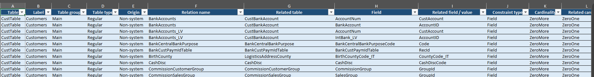
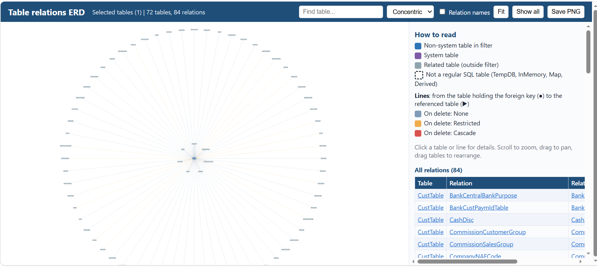

# 📚 Table Relation Explorer

> A Microsoft Dynamics 365 Finance and Operations utility for exploring table relationships and exporting them to Excel or an interactive ERD.

## 📑 Table of contents

- [✨ Overview](#-overview)
- [🚀 Features](#-features)
- [🧭 How to use](#-how-to-use)
- [📦 Export files](#-export-files)
- [🖼️ Previews](#️-previews)
- [🗺️ Understanding the ERD](#️-understanding-the-erd)
- [🏗️ Project structure](#️-project-structure)
- [⚙️ Setup and deployment](#️-setup-and-deployment)
- [🔐 Security](#-security)
- [📝 Notes and limitations](#-notes-and-limitations)

## ✨ Overview

Table Relation Explorer reads table and relation metadata from the D365FO runtime dictionary. Select one or more tables, choose whether views should be included, and generate an Excel workbook, an interactive entity relationship diagram (ERD), or both.

The collector scans selected tables once and shares the resulting relation data with the chosen exporters. The utility reads metadata only; it does not create or update business data.

## 🚀 Features

- 🔎 **Exact table selection** — search the table lookup and select one or multiple table names.
- 📋 **Export all tables** — optionally include all runtime tables instead of selecting specific tables.
- 👁️ **Optional views** — include or exclude selected views using **Include views / data entities**.
- 📊 **Formatted Excel workbook** — relation details, table type counts, export summary, and a color legend.
- 🗺️ **Interactive ERD** — search tables, inspect relations and field links, change layouts, and save a PNG.
- 📦 **Combined download** — when both outputs are selected, download one ZIP containing the Excel workbook and ERD HTML.
- ⚡ **Shared collection pass** — relation data is collected once, even when both output formats are selected.

## 🧭 How to use

1. Open **System administration > Inquiries > Table relation exporter**.
2. For a targeted export, use **Tables to export** to choose one or more exact table names. The lookup supports multiple selections.
3. Set **Export all tables** to **Yes** to ignore the selection and process every runtime table.
4. Set **Include views / data entities** to **Yes** if selected views should be included. When set to **No**, selected views are skipped.
5. Select **Export to Excel**, **Export ERD diagram (HTML)**, or both.
6. Confirm the dialog and retrieve the generated download.

> 💡 Selecting a table does not automatically select its related tables. Related tables may appear in the ERD as context, but their own relations are collected only when those tables are selected for export.

## 📦 Export files

### Excel workbook

The workbook contains two worksheets:

| Worksheet | Contents |
|---|---|
| **Relations** | One row per relation field link. Tables without relations still receive a row. |
| **Summary** | Filter description, table and relation totals, table type counts, color legend, and notes. |

The **Relations** sheet includes table name and label, table group and type, origin, relation and related table names, field mappings or fixed values, constraint type, and available relation properties.

Rows are colored to distinguish alternating table groups, self-references, and tables without relations. The workbook uses ARGB integer color values to avoid `System.Drawing.Color` type conflicts in X++.

### Interactive ERD

The HTML diagram provides:

- 🔍 Table search
- 🧩 Organic, concentric, hierarchy, circle, and grid layouts
- 🏷️ Optional relation-name labels
- 🖱️ Clickable tables and relations with field-link and property details
- 🖼️ PNG export

### Download behavior

| Selected output | Download |
|---|---|
| Excel only | `TableRelations.xlsx` |
| ERD only | `TableRelationsERD.html` |
| Excel and ERD | `TableRelationExport.zip`, containing both files |

## 🖼️ Previews

### 📊 Excel relations worksheet

The Relations worksheet presents table metadata and relation field links in a filterable, color-formatted table.



### 🗺️ Interactive ERD

The ERD provides a graph view alongside a searchable table and relation details panel.



## 🗺️ Understanding the ERD

- 🔵 **Blue node** — non-system table included in the selection.
- 🟣 **Purple node** — system table included in the selection.
- ⚪ **Gray node** — related table outside the selection; its own metadata was not collected.
- ⬚ **Dashed outline** — table type is not a regular SQL table, such as TempDB, InMemory, Map, or Derived.
- ➡️ **Directed relation line** — runs from the table holding the foreign key to the referenced table.
- 🎨 **Line color** — indicates the relation's on-delete behavior when available.

Selecting a table shows its outgoing and incoming relations. Selecting a relation shows its field links, cardinality, relationship type, and on-delete property when available.

## 🏗️ Project structure

The exporter is separated into four X++ classes:

| Class | Responsibility |
|---|---|
| `TableRelationExporter` | Displays and validates the dialog, coordinates the workflow, and delivers the requested output. |
| `TableRelationDataCollector` | Scans the runtime dictionary, applies selected-table and view filters, and creates relation rows and counts. |
| `TableRelationExcelExporter` | Creates the formatted Excel workbook. |
| `TableRelationErdExporter` | Creates the interactive ERD HTML document. |

## ⚙️ Setup and deployment

1. Add all four classes to the target D365FO model and build the model.
2. Add an **Action menu item** with **Object Type** set to **Class** and **Object** set to `TableRelationExporter`.
3. Add the action menu item under the **Inquiries** node of an extension of the `SystemAdministration` menu.
4. Build and deploy the model following your environment's normal D365FO process.
5. Grant access through the appropriate security privilege, duty, and role in your model.
6. Assign the role to a test user and run a small export first.

The Excel exporter uses EPPlus APIs available to the application. Verify the library reference is present in the target environment before deployment.

## 🔐 Security

Use least-privilege security for this read-only metadata utility:

```text
Security role
└── Security duty
    └── Security privilege
        └── TableRelationExporter action menu item (Invoke)
```

Use your organization's naming and label conventions for the role, duty, privilege, and menu item. Avoid granting unrelated table or maintenance permissions.

## 📝 Notes and limitations

- ⚠️ **ERD size limit:** the ERD exporter skips diagrams that exceed 300 total nodes. The count includes related tables outside the selection. Narrow the table selection to produce a readable diagram.
- 🌐 **Internet access:** the HTML viewer loads Cytoscape.js from a CDN, so the browser needs internet access to render the interactive graph.
- 🧱 **Related tables are context only:** gray related-table nodes are not included in the selected-table collection unless explicitly selected.
- 👁️ **View filtering:** the include-views option controls whether selected runtime views are processed. It does not automatically add views related to selected tables.
- 🧾 **Relation properties may be blank:** properties unavailable in base metadata—for example, some relations introduced by table extensions—may appear empty.
- 🏷️ **Origin classification:** output distinguishes system from non-system tables; it does not automatically determine whether a non-system table is custom or standard.
- 📂 **All-tables mode:** Excel can be generated for all tables, but the ERD is intentionally skipped for that mode.

---

Made for exploring D365FO table metadata more clearly. 🧭
